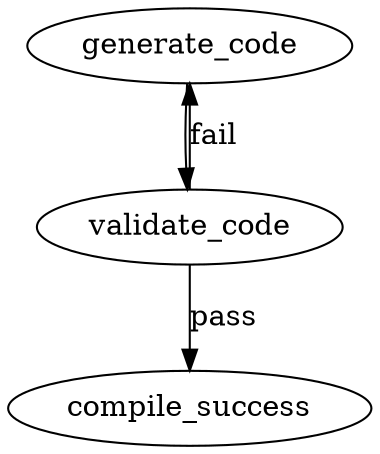

# SPEC-005: Automated Project Initialization and Declarative Quality Loops (`pas init`)

**Revision:** 2 (2026-06-03 — closes P1-1 through P1-4 per review)
**Status:** Approved for implementation

---

## 1. Overview & Objective

To maximize "Vibe Coding" velocity within Pascal's Discrete Attractor (PAS), we must eliminate manual scaffolding configuration. This specification details the implementation of the `pas init` subcommand—a smart, engine-aware bootstrapping system that automatically detects a codebase's toolchain (Rust, Python, TypeScript), configures local quality gates, and generates a structured `pas.toml` manifest file.

Furthermore, this document specifies how the `pas` core engine natively consumes `pas.toml` during execution to handle recursive, agentic self-correction loops when quality checks fail.

---

## 2. The `pas init` Subcommand Architecture

When a user or autonomous workspace builder executes `pas init`, the CLI triggers a **three-phase** initialization process combining high-speed deterministic static scanning with a lightweight agentic evaluation step and an interactive confirmation phase.

```
[pas init] ──> Phase 1: Static Heuristics ──> Phase 2: Agentic Enrichment ──> Phase 3: TUI Confirmation ──> [pas.toml Generated]
```

### CLI Flags

| Flag | Description |
| :--- | :--- |
| `--force` | Overwrite an existing `pas.toml` without prompting. Also bypasses the "no git repo" refusal in non-interactive mode. |
| `--non-interactive` / `--yes` | Skip Phase 3 TUI; write manifest directly. Implied when stdout is not a TTY. |
| `--no-enrich` | Skip Phase 2 LLM enrichment even when multiple toolchains are detected. |
| `--dry-run` | Print the planned `pas.toml` to stdout without writing to disk. |

**Existing `pas.toml` handling:**

- Interactive mode: prompt to confirm overwrite. Default is **N** (do not overwrite).
- Non-interactive mode (no TTY or `--non-interactive`): refuse to overwrite without `--force`.
- `--force` always overrides both the "existing manifest" and "no git repo" refusals.

**Non-interactive / autonomous mode:**

| Env var | Effect |
| :--- | :--- |
| `PAS_NON_INTERACTIVE=1` | Behaves as `--non-interactive` even when a TTY is detected. |
| `PAS_AGENT=1` | Implies `PAS_NON_INTERACTIVE=1` + `PAS_TRUST_THIS=1`. Single flag for orchestrators and subagents. |

### Phase 1: Static Signature Heuristics

The CLI natively performs rapid pattern matching on the current working directory to identify the dominant programming languages and tooling stacks:

| Signature File | Detected Toolchain | Default Quality Target Framework |
| :--- | :--- | :--- |
| `Cargo.toml` | Rust | `cargo fmt`, `cargo clippy`, `cargo test` |
| `pyproject.toml`, `poetry.lock`, `requirements.txt` | Python | `ruff format`, `ruff check`, `mypy`, `pytest` |
| `package.json`, `tsconfig.json` | TypeScript / Node | `prettier`, `eslint`, `tsc --noEmit`, `vitest`/`jest` |

### Phase 2: Lightweight Agentic Enrichment

Phase 2 is triggered when **any** of the following conditions are true:

| Condition | Trigger |
| :--- | :--- |
| ≥2 distinct toolchains detected in Phase 1 | Polyglot resolution needed |
| Detected language has no recognized config file | Ambiguous project structure |
| Phase 1 produces no detection results | Unknown ecosystem |

If `--no-enrich` is set, Phase 2 is skipped and `pas init` emits a multi-language stub manifest with all detected stage blocks and a `# TODO: review and consolidate` comment header.

**Payload:** The agent is supplied with a **positive allowlist** of filenames only. Files not matching the allowlist are excluded from the LLM payload regardless of their presence on disk.

Allowed filenames (exact match or glob):
`Cargo.toml`, `package.json`, `pyproject.toml`, `tsconfig*.json`, `requirements*.txt`, `setup.py`, `setup.cfg`, `pnpm-lock.yaml`, `yarn.lock`, `poetry.lock`, `.gitignore`, `README.md`, `Makefile`

Files matching `.env*`, `*.key`, `*.pem`, `secrets/*`, `.git/`, `node_modules/`, `target/`, `__pycache__/` are **never** sent, even if they match an allowlist pattern. The allowlist fails closed — new ecosystem files require an explicit allowlist update.

**Objective:** Determine the precise build commands, lint boundaries, and execution contexts that static scanning might misinterpret.

**Fallback:** If the LLM errors or times out, Phase 2 falls back silently to the unenriched multi-stage stub from Phase 1. Phase 2 is a hint, not authoritative.

### Phase 3: Interactive TUI Confirmation

Before generating the manifest, the CLI outputs a clean user interface (via `dialoguer`) displaying the discovered configurations, giving the user an immediate opportunity to modify hooks before writing to disk.

**TUI library:** `dialoguer` (version 0.12+). `ratatui` is explicitly deferred to a future `pas dashboard` feature.

Phase 3 is skipped when:
- stdout is not a TTY
- `--non-interactive` / `--yes` is passed
- `PAS_NON_INTERACTIVE=1` is set

---

## 3. Complete `pas.toml` Manifest Schema Specification

The `pas.toml` file resides at the root of the project codebase. The `pas` engine parses this file at runtime using a strongly-typed Rust parser (`toml` crate, version 1.x).

```toml
[project]
name = "pascals-discrete-attractor"
version = "0.1.0"
primary_language = "rust" # Options: rust | python | typescript | custom

[toolchain]
# Allows the local agent to understand compilation constraints
min_version = "1.75.0"
package_manager = "cargo"

[quality]
# Required: explicit ordered list of stages to execute
stages = ["format", "lint", "typecheck", "test"]

[quality.hooks.format]
cmd = "cargo fmt --check"
allow_failure = false

[quality.hooks.lint]
cmd = "cargo clippy --all-targets -- -D warnings"
allow_failure = false

[quality.hooks.typecheck]
cmd = "cargo check"
allow_failure = false

[quality.hooks.test]
cmd = "cargo test -- --nocapture"
allow_failure = false

[quality.telemetry]
# Dictates how error logs are parsed and summarized before injection into the LLM prompt
parse_ansi_escape_codes = true
truncate_logs_after_bytes = 4096

[agent.loop_control]
# Hard stops to protect API spend and prevent infinite loops
max_fix_iterations = 3
```

**Schema notes:**

- `[quality] stages` is **required** and defines execution order. The engine runs stages in the order listed, not in TOML key order.
- Each stage in `stages` must have a corresponding `[quality.hooks.<stage>]` sub-table.
- Stage names in `stages` must be unique.
- `cmd` strings must be non-empty and ≤4 KB.
- The `toml` crate (1.x) is used for the read path; `toml_edit` (0.22+) is used for the `pas init` write path to preserve comments and key ordering on re-runs.
- `allow_failure = true` semantics: a non-zero exit code emits a `WARN`-level log entry but the engine proceeds to the next stage. The node final status is `pass` if all `allow_failure = false` stages succeed.
- `backoff_factor` is not a supported field in v1. A hardcoded 1-second sleep is applied between retry iterations.

**Reserved future fields (do not implement in v1):**

- `[quality.hooks.<stage>].depends_on` — per-stage dependency ordering
- `[quality.hooks.<stage>].cwd` — per-stage working directory override
- `[quality.hooks.<stage>].env` — per-stage environment variable map
- `[quality.hooks.<stage>].timeout_secs` — per-stage timeout override

### Alternative Reference Definitions (Python & TypeScript)

#### Python Template

```toml
[quality]
stages = ["format", "lint", "typecheck", "test"]

[quality.hooks.format]
cmd = "ruff format --check ."
allow_failure = false

[quality.hooks.lint]
cmd = "ruff check ."
allow_failure = false

[quality.hooks.typecheck]
cmd = "mypy ."
allow_failure = false

[quality.hooks.test]
cmd = "pytest -v"
allow_failure = false
```

#### TypeScript Template

```toml
[quality]
stages = ["format", "lint", "typecheck", "test"]

[quality.hooks.format]
cmd = "npx prettier --check ."
allow_failure = true

[quality.hooks.lint]
cmd = "npm run lint"
allow_failure = false

[quality.hooks.typecheck]
cmd = "npx tsc --noEmit"
allow_failure = false

[quality.hooks.test]
cmd = "npx vitest run"
allow_failure = false
```

---

## 4. Core Rust Engine Runtime Integration

### 4.1 Graphviz `.dot` Integration

To activate the declarative checks within a PAS workflow, developers or autonomous generation loops use the `quality` handler. The handler name is lowercase without a namespace prefix, matching the existing convention (`codergen`, `wait_human`, `parallel`).



### 4.2.0 Manifest Resolution

Before executing any stage, the engine resolves `pas.toml` by walking upward from `--workdir` (canonicalized at entry; symlinks are not followed during ascent). The walk is bounded to **16 ascents**. It stops at the first `.git` directory or workspace root marker (`Cargo.toml` with `[workspace]`, `pyproject.toml`, or `package.json`). The **first `pas.toml` found wins**.

**Resolution outcomes:**

| Outcome | Condition | Engine behavior |
| :--- | :--- | :--- |
| `Found(path, blake3_hash)` | `pas.toml` exists and parses cleanly | Cache on `RunContext`; proceed to trust check |
| `NotFound { searched: Vec<PathBuf> }` | No `pas.toml` in the walk range | Handler returns `Fail` with `system_guidance = "No pas.toml found at <searched paths>. Run 'pas init' to generate one."` |
| `Malformed { path, diagnostic }` | `pas.toml` exists but fails TOML parse | Handler returns `Fail` with `last_error_log = "<toml parse diagnostic>"`. No silent fallback to defaults. |
| `Invalid { path, missing_fields }` | Parses as TOML but fails schema validation | Same as `Malformed` |

**No silent fallback to defaults.** Silent fallbacks have hidden a category of bugs already fixed elsewhere.

**Startup warning (preflight):** When `pas run` loads a pipeline, it scans for `handler="quality"` nodes. If any are present and no `pas.toml` can be resolved at `--workdir`, it emits a single structured warning at startup:

```
WARN: pipeline uses the 'quality' handler but no pas.toml was found at <workdir>. Run 'pas init' to generate one. The quality node will fail when reached.
```

The pipeline still starts (dry-runs and partial executions work), but the quality node will fail when reached. The warning **does not fire** when no node uses the `quality` handler.

**Resolution is performed exactly once per `pas run` invocation** (in the preflight layer, before any node executes). The result is stored on `RunContext.quality_manifest`. The handler reads from the cache; it does not re-resolve.

### 4.2 Runtime Order of Operations

When the execution engine hits a node bound to `handler="quality"`, it uses the pre-resolved manifest from `RunContext` and executes stages asynchronously:

1. **Load Config:** Reads the pre-resolved `pas.toml` from `RunContext.quality_manifest`. If resolution produced an error variant, returns `Fail` immediately with structured `system_guidance`.
2. **Trust Check:** Verifies the manifest is trusted (see §6). In non-TTY contexts with no trust entry, aborts with exit code 2.
3. **Sequential Loop:** Iterates through stages in the order defined by `[quality] stages`.
4. **Process Execution:** Executes the mapped `cmd` string via `tokio::process::Command` (not `std::process::Command` — the tokio runtime must not be blocked during long test runs). Each stage runs in its own process group to enable orphan-free cancellation.
5. **Exit Evaluation:**
   - If a command exits with code `0`, it proceeds to the next stage.
   - If a command exits with a non-zero code and `allow_failure = false`, execution breaks immediately. The engine marks the node status as `fail`.
   - If a command exits with a non-zero code and `allow_failure = true`, a `WARN`-level log entry is emitted and execution continues.

---

## 5. Telemetry Feedback and Agent Self-Correction

When a quality hook encounters a failure, raw CLI dump text can confuse an LLM agent or cause model distraction. The `quality` handler processes the telemetry payload systematically before feeding it into the edge routing state.

### 5.1 Telemetry Context Schema

When a failure occurs, the engine populates the internal node outcome state with the following payload structure. `last_error_log` is JSON-string-encoded: newlines, tabs, and quotes are escaped per RFC 8259. The field is bounded by `truncate_logs_after_bytes` from `[quality.telemetry]`; this bound is a hard contract guarantee on the output schema that downstream consumers can rely on.

```json
{
  "status": "fail",
  "failed_stage": "typecheck",
  "execution_metadata": {
    "command_attempted": "cargo clippy --all-targets -- -D warnings",
    "exit_code": 101,
    "working_directory": "/workspace/pascals-discrete-attractor"
  },
  "context_updates": {
    "last_error_log": "error[E0308]: mismatched types\n  --> src/main.rs:42:18\n   |\n42 |     let x: String = 100;\n   |            ------   ^^^ expected struct `String`, found integer\n   |            |\n   |            expected due to this",
    "system_guidance": "The code you generated failed compilation during the 'typecheck' phase. Read the exact error trace above carefully and refactor the source code to fix the type definitions.",
    "failure_footprint": "a3f9c2b14e8d7012"
  }
}
```

**`failure_footprint`** is a 16-character hex string: the first 16 bytes of a BLAKE3 hash computed over `failed_stage + "|" + first_2KB(last_error_log)` (after ANSI escape code stripping). It is used by loop control (§5.2) to detect identical error states across iterations.

**Output truncation strategy:** Per-command output is captured into a bounded ring buffer. Truncation uses a head-and-tail strategy: the first 25% of bytes are preserved, followed by `... [<N> bytes truncated] ...`, followed by the last 75% of bytes. This preserves both setup context and the actual failure line. The total size is bounded by `truncate_logs_after_bytes`.

### 5.2 Mitigation of Agentic Infinite Loops

If the `codergen` node repeatedly loops back to `quality` with the same error footprint, the engine intervenes using the parameters defined in `[agent.loop_control]`:

1. **Iteration Tracking:** Increment the internal loop counter keyed on the `quality` node ID. The counter resets when control enters the `quality` node from a different upstream node (i.e., the counter is bound to the `quality` node, not the upstream `codergen` node). The counter and last `failure_footprint` are persisted to the checkpoint so resume preserves them — a resumed pipeline does not reset to zero.
2. **Prompt Modification:** On iteration 2 and higher, the engine prepends a structured retry warning to the downstream node's context:

   ```xml
   <retry-warning iteration="2" prev-footprint="a3f9c2b14e8d7012">
   This is your second attempt to fix the failed quality stage 'typecheck'. The previous attempt produced an identical error footprint. Try a structurally different approach.
   </retry-warning>
   ```

3. **Hard Ceiling:** Once `max_fix_iterations` is exhausted, the CLI aborts execution cleanly with exit code 1 and a final log entry naming the unhealing stage. A hardcoded 1-second sleep is applied before the second and subsequent iterations.

---

## 6. Trust Model

### 6.1 Motivation and Threat Model

`pas.toml` is intended to be checked into version control. The implied flow `git clone <repo> && pas run <pipeline>` means an attacker-controlled `pas.toml` can execute arbitrary shell commands via the `cmd` fields. This is not theoretical for a CLI whose purpose is to run AI-generated and template-generated code.

**Threats addressed by this model:**

- **Clone scenario:** `pas.toml` author ≠ `pas` runner. A cloned repository with a malicious `pas.toml` should not silently run its commands.
- **Supply-chain modification:** `pas.toml` modified by a checked-in pre-commit hook after the user last reviewed it.

**Not addressed in v1 (documented explicitly to prevent future ambiguity):**

- `pas.toml` symlinked to `/dev/random` or `/proc/*` — resource exhaustion via symlink. Mitigated partially by the canonicalized walk-up (see §4.2.0), but not fully defended.
- Cross-process trust invalidation mid-run — a `pas trust --remove` in a separate terminal does not affect an in-flight pipeline.

### 6.2 Trust File

Trust state is stored at `$XDG_CONFIG_HOME/pas/trusted.json` (fallback: `~/.config/pas/trusted.json`). The file has permissions `0600` on Unix. Writes use `tempfile::NamedTempFile` + atomic `persist()` rename to prevent corruption from concurrent invocations.

```json
{
  "trusted": [
    {
      "path": "/absolute/path/to/repo",
      "blake3": "<blake3 hash of pas.toml at time of trust grant>",
      "trusted_at": "2026-05-29T14:00:00Z",
      "source": "pas init"
    }
  ]
}
```

Trust is keyed on `(absolute_path, blake3(pas.toml))`. Editing `pas.toml` changes its hash, which invalidates the trust entry. The next `pas run` will re-prompt (interactive) or abort with exit code 2 (non-interactive).

### 6.3 Trust Prompt Behavior

On first `pas run` in a directory whose `pas.toml` hash is not in `trusted.json`:

- **Interactive TTY:** Display the resolved `pas.toml` path and hash. Prompt the user to trust. On confirmation, write the trust entry and proceed. This is the same pattern as `direnv allow` and VS Code Workspace Trust.
- **Non-TTY / `PAS_NON_INTERACTIVE=1`:** Abort with exit code 2 and message: `"Untrusted manifest at <path>. Run 'pas trust --add <path>' or pass --trust to authorize, or run 'pas init' to generate a trusted manifest."`
- **`--trust` flag:** One-shot trust for this run only; does not write to `trusted.json`.
- **`PAS_TRUST_THIS=1`:** Same as `--trust` for CI contexts.
- **`PAS_AGENT=1`:** Implies `PAS_TRUST_THIS=1` (see §2 CLI Flags).

### 6.4 Auto-Trust on `pas init`

`pas init` writes the trust entry as its final step, keyed on the manifest it just wrote. A user who ran `pas init` does not see a trust prompt on the first `pas run`. The trust entry records `"source": "pas init"`.

### 6.5 `pas trust` Subcommand

Trust management is a first-class CLI subcommand for symmetric human/agent access:

| Command | Description |
| :--- | :--- |
| `pas trust --add <path>` | Add trust entry for the `pas.toml` at `<path>` (uses current blake3 hash) |
| `pas trust --remove <path>` | Remove trust entry for `<path>` |
| `pas trust --list` | List all trusted paths and their hashes |

**Exit codes for `pas trust`:**

| Code | Condition |
| :--- | :--- |
| 0 | Success |
| 2 | `TrustError::Untrusted` — entry not present or hash mismatch (recoverable) |
| 3 | `TrustError::CorruptedStore` — trust file malformed or unreadable (manual intervention required) |

### 6.6 Prior Art

This trust model is directly analogous to `direnv allow` (per-directory shell trust) and `mise trust` (per-config-file tool trust). Both use a file-hash-keyed allowlist. The `PAS_TRUST_THIS` env var parallels `MISE_TRUSTED_CONFIG_PATHS`.

---

## Appendix: Summary of Changes from Revision 1

| Change | Review finding | Section affected |
| :--- | :--- | :--- |
| Added §4.2.0 Manifest Resolution (walk-up, `NotFound`/`Malformed`/`Invalid` variants, startup warning) | P1-1 | §4.2.0 |
| Added §6 Trust Model (XDG trust file, direnv-style prompt, auto-trust on init, `pas trust` subcommand) | P1-2 | §6 |
| Fixed malformed telemetry JSON (`\n`-escaped newlines, added `failure_footprint` field) | P1-3 | §5.1 |
| Restructured schema: `stages` array + `[quality.hooks.<stage>]` sub-tables | P1-4 | §3 |
| Renamed `serde_toml` → `toml` (correct crate name, 1.x) | P2-1 | §3 |
| Renamed "two-phase" → "three-phase"; added `--yes`/`--non-interactive`/`--no-enrich`/`--force`/`--dry-run` flags | P2-2 | §2 |
| Clarified `allow_failure = true` semantics | P2-3 | §3 |
| Specified Phase 2 trigger conditions as a decision table | P3-3 | §2 |
| Added filename allowlist for LLM payload; renamed `--no-agent` → `--no-enrich` | P3-3 | §2 |
| Renamed handler `pas::quality` → `quality` (matches existing convention) | P2-6 | §4.1 |
| Replaced "quality runner thread" framing with `tokio::process::Command` | P2-6 | §4.2 |
| Defined `failure_footprint` (BLAKE3, closes loop-control ambiguity) | P2-5 | §5.1, §5.2 |
| Clarified loop counter binding to `quality` node ID; checkpoint persistence | P2-5 | §5.2 |
| Removed `backoff_factor` field (hardcoded 1-second sleep in v1) | P2-5 | §3, §5.2 |
