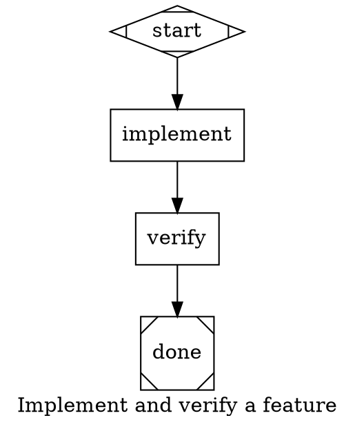

# Quality Handler Design

**Date:** 2026-06-03
**Status:** Approved
**Scope:** `crates/attractor-pipeline` only

---

## Overview

Add a `quality` handler to PAS CLI that runs a suite of code quality checks as a pipeline node. Checks are real shell commands (static analysis, type checking, unit tests, lint) that run sequentially and return structured pass/fail output to the pipeline context. This replaces the current practice of using a `diamond` conditional node where Claude reviews its own code — real tool exit codes replace Claude's self-assessment.

The handler is enabled by default. Two mechanisms exist to disable it: a node attribute for static pipeline authoring, and a runtime context flag for callers like Reckoner.

---

## Problem

The current `verify` node in PAS pipelines is a `diamond` (conditional) node where Claude reads its own code changes and outputs `PASS` or `FAIL`. This is unreliable — Claude has no ground truth. Real quality checks (clippy, cargo test, ruff, tsc) have objective exit codes. The pipeline has no way to run those tools today except through the single-command `tool` handler (parallelogram), which can only run one command and writes no structured failure output for retry nodes to consume.

---

## Solution

A new `quality` handler registered as handler type `"quality"`. Pipeline nodes opt into it via `node_type="quality"` on a `box`-shaped node. The handler runs a pipe-delimited list of commands from the `quality_checks` attribute, accumulates per-check results, writes a failure summary to context, and returns `Success` or `Fail` using the same `Outcome` struct as every other handler.

---

## DOT Schema

```dot
verify [
    shape="box"
    node_type="quality"
    label="Verify"
    quality_checks="cargo fmt --check|cargo clippy -- -D warnings|cargo test --workspace"
    goal_gate=true
    retry_target="implement"
]
```

### Node Attributes

| Attribute | Type | Required | Default | Description |
|---|---|---|---|---|
| `quality_checks` | string | yes | — | Pipe-delimited (`\|`) list of shell commands to run in order |
| `node_type` | string | yes | — | Must be `"quality"` to invoke this handler |
| `enabled` | bool | no | `true` | Set `false` to disable all checks; handler returns `Success` immediately |

`goal_gate` and `retry_target` are standard `PipelineNode` attributes and work unchanged — no special treatment needed.

### Runtime Context Flag

| Key | Type | Description |
|---|---|---|
| `quality_disabled` | bool | When `true`, handler returns `Success` immediately regardless of `enabled` attribute |

---

## Execution Model

Commands are run sequentially in the order they appear in `quality_checks`. Each command is executed via `tokio::process::Command` with `sh -c`, using the `workdir` from context as the working directory (same as `ToolHandler`).

Execution is fail-fast: the first non-zero exit code stops the run. Remaining commands are not executed. The `results` context array contains entries only for commands that were actually run. The overall `Outcome` status is `Fail` if any executed command exited non-zero, `Success` if all exited zero.

### Context Updates Written

| Key | Type | Contents |
|---|---|---|
| `{node_id}.results` | JSON array | One object per check: `{cmd, exit_code, passed, stderr}` |
| `{node_id}.failure_summary` | string | Concatenated stderr from all failed checks — intended for use in the retry node's prompt |
| `{node_id}.completed` | bool | Always `true` after handler runs |

The retry node (`implement`) can reference `verify.failure_summary` in its prompt so Claude receives the actual error output rather than a vague "quality checks failed" message.

---

## Disable Behaviour

Both disable paths return `StageStatus::Success` (not `Skipped`). This is deliberate: `StageStatus::Skipped` does not satisfy a `goal_gate` check in the engine, which would break pipelines that have `goal_gate=true` on the verify node. Returning `Success` means the pipeline continues normally regardless of whether checks actually ran.

### Decision order (checked before any commands run)

1. `node.raw_attrs["enabled"] == false` → return `Success`, note: `"quality checks disabled (node)"`
2. `context["quality_disabled"] == true` → return `Success`, note: `"quality checks disabled (runtime)"`
3. Run `quality_checks` commands sequentially

### Behaviour table

| State | Triggered by | Checks run | Returns | `goal_gate` satisfied |
|---|---|---|---|---|
| Enabled, all pass | default | yes | `Success` | yes |
| Enabled, any fail | default | yes | `Fail` | no → retry |
| Disabled (node) | `enabled=false` | no | `Success` | yes |
| Disabled (runtime) | `quality_disabled=true` | no | `Success` | yes |

---

## Implementation

### File

`crates/attractor-pipeline/src/handlers/quality_handler.rs`

### Registration

Added to `default_registry()` in `crates/attractor-pipeline/src/handler.rs`:

```rust
reg.register(crate::handlers::QualityHandler);
```

Exported from `crates/attractor-pipeline/src/handlers/mod.rs`:

```rust
pub mod quality_handler;
pub use quality_handler::QualityHandler;
```

No new shape mapping needed in `HandlerRegistry::shape_to_type` — the `node_type="quality"` attribute on a `box` node is resolved by the existing explicit `node_type` lookup (first priority in `resolve_type()`).

### Structure (mirrors ToolHandler)

```rust
pub struct QualityHandler;

impl NodeHandler for QualityHandler {
    fn handler_type(&self) -> &str { "quality" }

    async fn execute(&self, node: &PipelineNode, context: &Context, _graph: &PipelineGraph)
        -> Result<Outcome>
    {
        // 1. Check enabled=false node attribute
        // 2. Check quality_disabled context flag
        // 3. Read quality_checks from raw_attrs, split on '|'
        // 4. For each command: spawn via sh -c, capture stdout/stderr, record result
        // 5. Build results JSON array and failure_summary string
        // 6. Return Success or Fail with context updates
    }
}
```

### Timeout

Uses `node.timeout` if set, falls back to 10 minutes (double the `ToolHandler` default of 5 min, since test suites can be slow). Applied per individual command, not across the whole suite.

### Output truncation

Per-command stderr is truncated to 8 KB before being written to context. `failure_summary` is the concatenation of truncated stderr from all failed checks. This keeps context size bounded when a noisy test suite fails.

---

## What Does Not Change

- `goal_gate` + `retry_target` engine mechanics (no changes to `goal_gate.rs`)
- `NodeHandler` trait (no changes to `handler.rs` trait definition)
- `Context`, `Outcome`, `StageStatus` types (no changes to `attractor-types`)
- `HandlerRegistry` shape mappings (no new shape added)
- `ToolHandler` (not modified)

---

## Out of Scope

The following are explicitly deferred and not part of this implementation:

- `pas.toml` manifest file (SPEC-005) — commands live inline in the DOT node for now
- Per-repo toolchain auto-detection — pipeline author specifies commands explicitly
- Trust model for executing commands — commands are in the DOT file under version control
- LLM enrichment of failure output — raw stderr is sufficient for retry context
- Continue-on-failure mode — all checks stop at first failure in v1 (configurable later via `fail_fast=false`)

---

## Example Pipeline



On failure, `verify.failure_summary` is available in context. The `implement` node prompt should reference it:

```dot
implement [
    shape="box"
    prompt="Implement the feature per .pas/spec.md.
If context key 'verify.failure_summary' is set, fix the failures described there first."
]
```
